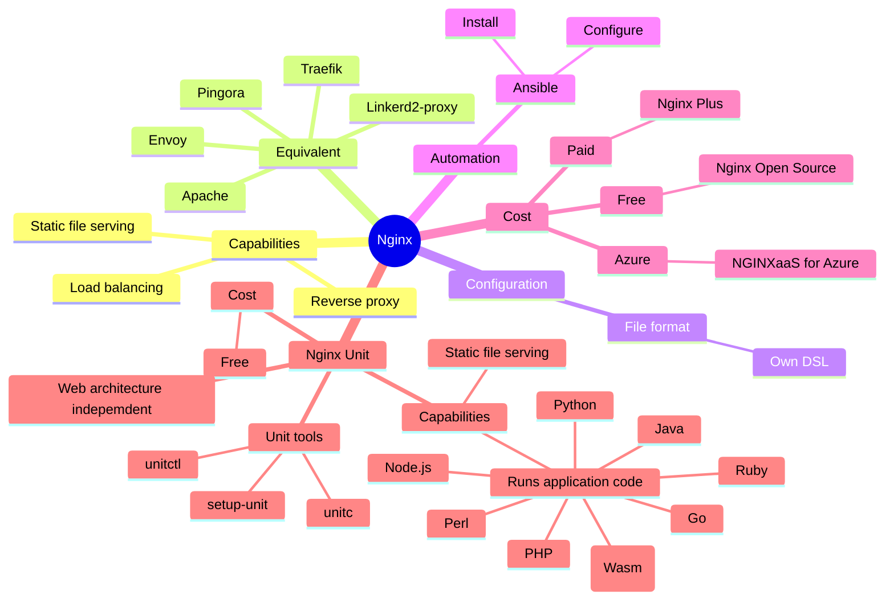

# nginx-adventure

Going through nginx capabilities.



## Usage of web servers broken down by ranking

Nginx is the #1 web server at the 100,000 busiest websites in the world.

https://w3techs.com/technologies/cross/web_server/ranking

## Equivalent

Apache vs Nginx
- Homepage: https://httpd.apache.org/
- https://www.digitalocean.com/community/tutorials/apache-vs-nginx-practical-considerations
> For static content, which Nginx excels at, files or other directives will be served quickly and directly to the client. For dynamic content, for instance PHP files, Nginx will proxy the request to Apache, which can then process the results and return the rendered page. Nginx can then pass the content back to the client.

Cloudflare
- Pingora: https://blog.cloudflare.com/how-we-built-pingora-the-proxy-that-connects-cloudflare-to-the-internet/
- Github: https://github.com/cloudflare/pingora

Lyft
- Envoy: https://dropbox.tech/infrastructure/how-we-migrated-dropbox-from-nginx-to-envoy
- Homepage: https://www.envoyproxy.io/
- Github: https://github.com/envoyproxy/envoy

Linkerd
- Linkerd2-proxy: https://linkerd.io/2020/12/03/why-linkerd-doesnt-use-envoy/
- Github: https://github.com/linkerd/linkerd2-proxy

Traefik
- https://cast.ai/blog/traefik-vs-nginx/
- Github: https://github.com/traefik/traefik

### Configuration language
- Apache: Own DSL
- Nginx: Own DSL
- Traefik: YAML/TOML
- Linkerd2-proxy: handful of environment variables set at injection time and by the Linkerd control plane at runtime
- Pingora: Rust
- Envoy: YAML

## Infrastructure as Code

Terraform
- https://registry.tf-registry-prod-use1.terraform.io/providers/getstackhead/nginx/latest/docs

Ansible
- https://github.com/nginxinc/ansible-role-nginx-config
- https://symfonycasts.com/screencast/ansible/nginx-conf-template

Terraform and Ansible together
- https://spacelift.io/blog/using-terraform-and-ansible-together
> Terraform is used to manage your infrastructure, but Ansible is a better option if you want to install and configure software on your compute instances. You could use Terraform’s provisioners to achieve Ansible’s configuration management capabilities, but they are unreliable, and even HashiCorp recommends using them as a last resort. That’s why using Terraform and Ansible together can improve your workflows.

## Capabilities

- serve static files
- reverse proxy
- load balancing

```
Nginx is a powerful web server and reverse proxy that offers a wide range of capabilities, including:

1. **Load Balancing**: Distributes incoming traffic across multiple servers to ensure reliability and performance. Supports various algorithms like round-robin, least connections, and IP hash.

2. **Reverse Proxy**: Acts as an intermediary for requests from clients seeking resources from servers, enhancing security and performance.

3. **SSL/TLS Termination**: Handles SSL encryption and decryption, offloading this resource-intensive task from backend servers.

4. **Caching**: Improves response times and reduces server load by caching static content and proxying dynamic content.

5. **Content Compression**: Uses gzip and Brotli compression to reduce the size of responses, improving load times and bandwidth usage.

6. **Static File Serving**: Efficiently serves static content like images, CSS, and JavaScript files.

7. **WebSocket Support**: Facilitates real-time communication by supporting WebSocket protocols.

8. **URL Rewriting and Redirection**: Provides flexible URL manipulation and redirection capabilities.

9. **Security Features**: Includes features like access control, rate limiting, and support for various authentication methods.

10. **HTTP/2 and HTTP/3 Support**: Supports modern protocols for improved performance and resource loading.

11. **Monitoring and Logging**: Provides extensive logging capabilities and integration with monitoring tools for performance analysis.

12. **Microservices Support**: Works well in microservices architectures by managing service communication and load balancing.

13. **API Gateway Functionality**: Can act as an API gateway, managing and routing API requests effectively.

14. **GeoIP Support**: Allows geolocation-based routing and content delivery.

15. **Dynamic Module Support**: Offers the ability to extend functionality with custom modules.

These capabilities make Nginx a versatile choice for handling a wide range of web traffic and application architectures.
```

## Features depending on version

- https://docs.nginx.com/nginxaas/azure/overview/feature-comparison/
- https://wtit.com/compare-nginx-models-nginx-open-source-os-vs-plus-free-vs-paid/
- https://docs.nginx.com/nginxaas/azure/overview/overview/
- https://learn.microsoft.com/en-us/azure/partner-solutions/nginx/nginx-overview
